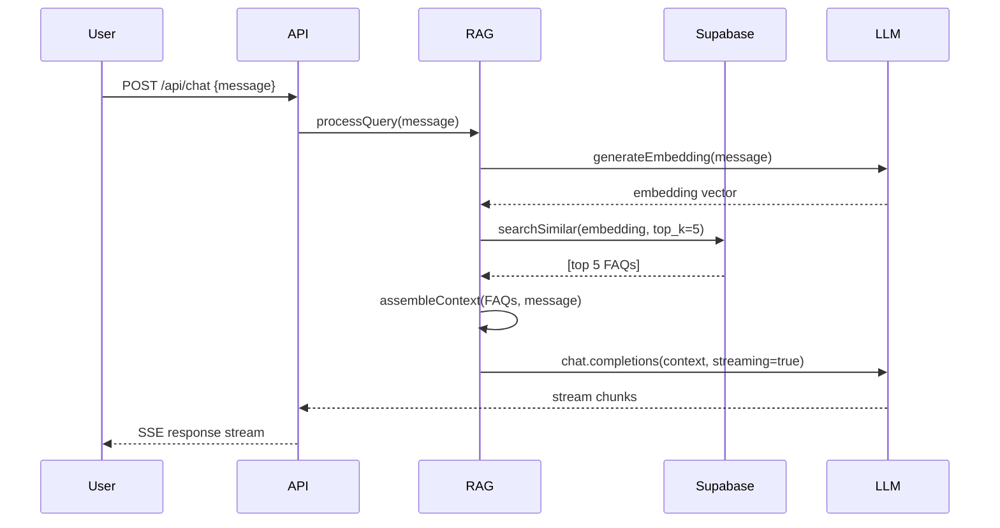

# 🏗️ Arquitectura RAG - FAQ Bot Universitario

## 📊 Visión General

Sistema de chatbot inteligente con Retrieval-Augmented Generation (RAG) para responder preguntas frecuentes de la comunidad universitaria, eliminando la necesidad de responder manualmente las mismas preguntas en WhatsApp.

---

## 🎯 Objetivos de Negocio

1. **Automatizar respuestas** a preguntas repetitivas (horarios, trámites, requisitos, etc.)
2. **Reducir carga** de moderadores/administradores en grupos de WhatsApp
3. **Mejorar experiencia** de estudiantes con respuestas instantáneas 24/7
4. **Mantener consistencia** en la información proporcionada
5. **Escalar conocimiento** de forma fácil con panel de administración

---

## 🏛️ Arquitectura del Sistema

```
┌─────────────────────────────────────────────────────────────┐
│                      USUARIO FINAL                          │
│               (Chat Web / WhatsApp)                         │
└────────────────────────┬────────────────────────────────────┘
                         │
                         ▼
┌─────────────────────────────────────────────────────────────┐
│                   FRONTEND (v0 + Next.js)                   │
│  • Chat Interface                                           │
│  • Admin Panel                                              │
│  • Streaming UI                                             │
└────────────────────────┬────────────────────────────────────┘
                         │
                         ▼
┌─────────────────────────────────────────────────────────────┐
│              BACKEND API (Express + Vercel)                 │
│                                                             │
│  ┌─────────────────┐  ┌─────────────────┐                 │
│  │  Chat Endpoint  │  │  Admin Endpoint │                 │
│  │  /api/chat      │  │  /api/admin/*   │                 │
│  └────────┬────────┘  └────────┬────────┘                 │
│           │                     │                           │
│           ▼                     ▼                           │
│  ┌──────────────────────────────────────┐                  │
│  │         RAG Pipeline                 │                  │
│  │  1. Query → Embedding                │                  │
│  │  2. Semantic Search (top-k)          │                  │
│  │  3. Context Assembly                 │                  │
│  │  4. LLM Generation                   │                  │
│  └──────────┬──────────┬────────────────┘                  │
└─────────────┼──────────┼──────────────────────────────────┘
              │          │
              ▼          ▼
┌─────────────────────┐  ┌────────────────────────┐
│   SUPABASE (DB)     │  │  OPENROUTER (LLM)      │
│  • pgvector         │  │  • GPT-4o-mini         │
│  • FAQs table       │  │  • Embeddings API      │
│  • Embeddings       │  │  • Chat completions    │
│  • Full-text search │  └────────────────────────┘
└─────────────────────┘
```

---

## 🗄️ Esquema de Base de Datos (Supabase)

### Tabla: `faqs`
```sql
CREATE TABLE faqs (
  id UUID PRIMARY KEY DEFAULT uuid_generate_v4(),
  question TEXT NOT NULL,
  answer TEXT NOT NULL,
  category VARCHAR(100),
  keywords TEXT[], -- Para búsqueda full-text
  metadata JSONB, -- Tags, fuente, fecha_actualizacion, etc.
  embedding vector(1536), -- OpenAI text-embedding-3-small
  created_at TIMESTAMP DEFAULT NOW(),
  updated_at TIMESTAMP DEFAULT NOW(),
  created_by VARCHAR(255),
  is_active BOOLEAN DEFAULT true
);

-- Índice para búsqueda semántica
CREATE INDEX ON faqs USING ivfflat (embedding vector_cosine_ops)
WITH (lists = 100);

-- Índice full-text para fallback
CREATE INDEX faqs_question_idx ON faqs USING GIN (to_tsvector('spanish', question));
CREATE INDEX faqs_answer_idx ON faqs USING GIN (to_tsvector('spanish', answer));
CREATE INDEX faqs_keywords_idx ON faqs USING GIN (keywords);
```

### Tabla: `documents` (para docs largos tipo PDFs, reglamentos)
```sql
CREATE TABLE documents (
  id UUID PRIMARY KEY DEFAULT uuid_generate_v4(),
  title TEXT NOT NULL,
  content TEXT NOT NULL,
  file_url TEXT,
  document_type VARCHAR(50), -- pdf, docx, txt
  category VARCHAR(100),
  metadata JSONB,
  created_at TIMESTAMP DEFAULT NOW(),
  updated_at TIMESTAMP DEFAULT NOW(),
  is_active BOOLEAN DEFAULT true
);
```

### Tabla: `document_chunks` (chunks de documentos con embeddings)
```sql
CREATE TABLE document_chunks (
  id UUID PRIMARY KEY DEFAULT uuid_generate_v4(),
  document_id UUID REFERENCES documents(id) ON DELETE CASCADE,
  chunk_text TEXT NOT NULL,
  chunk_index INTEGER NOT NULL,
  token_count INTEGER,
  embedding vector(1536),
  metadata JSONB,
  created_at TIMESTAMP DEFAULT NOW()
);

CREATE INDEX ON document_chunks USING ivfflat (embedding vector_cosine_ops)
WITH (lists = 100);
```

### Tabla: `chat_sessions` (historial de conversaciones)
```sql
CREATE TABLE chat_sessions (
  id UUID PRIMARY KEY DEFAULT uuid_generate_v4(),
  user_id VARCHAR(255),
  session_data JSONB, -- mensajes, contexto
  created_at TIMESTAMP DEFAULT NOW(),
  last_interaction TIMESTAMP DEFAULT NOW()
);
```

### Tabla: `analytics` (métricas del bot)
```sql
CREATE TABLE analytics (
  id UUID PRIMARY KEY DEFAULT uuid_generate_v4(),
  event_type VARCHAR(50), -- query, answer, fallback, admin_action
  user_id VARCHAR(255),
  query TEXT,
  matched_faqs UUID[],
  similarity_scores FLOAT[],
  response_time_ms INTEGER,
  tokens_used INTEGER,
  metadata JSONB,
  created_at TIMESTAMP DEFAULT NOW()
);
```

---

## 🔄 Pipeline RAG Detallado

### 1. **Ingesta de FAQs** (`POST /api/admin/faqs`)

```typescript
async function ingestFAQ(question: string, answer: string, category: string) {
  // 1. Generar embedding de la pregunta
  const embedding = await generateEmbedding(question);
  
  // 2. Extraer keywords automáticamente
  const keywords = extractKeywords(question + " " + answer);
  
  // 3. Insertar en Supabase
  const { data, error } = await supabase
    .from('faqs')
    .insert({
      question,
      answer,
      category,
      keywords,
      embedding,
      metadata: { source: 'admin_panel' }
    });
  
  return data;
}
```

### 2. **Búsqueda Semántica** (`searchSimilarFAQs`)

```typescript
async function searchSimilarFAQs(query: string, topK: number = 5) {
  // 1. Generar embedding de la query
  const queryEmbedding = await generateEmbedding(query);
  
  // 2. Búsqueda vectorial en Supabase
  const { data: results } = await supabase.rpc('match_faqs', {
    query_embedding: queryEmbedding,
    match_threshold: 0.7, // Similarity threshold
    match_count: topK
  });
  
  return results; // [{ id, question, answer, similarity }]
}
```

### 3. **Ensamblaje de Contexto** (`assembleContext`)

```typescript
function assembleContext(similarFAQs: FAQ[], query: string): string {
  const contextParts = similarFAQs.map((faq, idx) => `
[FAQ ${idx + 1}] (Relevancia: ${(faq.similarity * 100).toFixed(1)}%)
Pregunta: ${faq.question}
Respuesta: ${faq.answer}
Categoría: ${faq.category}
  `).join('\n---\n');
  
  return `
A continuación se presentan las preguntas frecuentes más relevantes de la base de conocimiento universitaria:

${contextParts}

Pregunta del usuario: ${query}

Instrucciones:
1. Usa SOLO la información de las FAQs anteriores para responder
2. Si la pregunta del usuario NO está cubierta en las FAQs, responde: "No tengo información sobre eso en mi base de conocimiento. Por favor contacta a [correo/grupo específico]"
3. Si hay información, responde de forma clara y concisa
4. Cita la FAQ de referencia si es relevante
5. Usa un tono amigable y profesional
`.trim();
}
```

### 4. **Generación con LLM** (`generateResponse`)

```typescript
async function generateResponse(query: string, context: string) {
  const messages = [
    {
      role: 'system',
      content: `Eres un asistente virtual de la comunidad universitaria. 
Tu objetivo es responder preguntas usando ÚNICAMENTE la información proporcionada en el contexto.
Nunca inventes información. Si no sabes la respuesta, admítelo.`
    },
    {
      role: 'user',
      content: context
    }
  ];
  
  // Llamada a OpenRouter (compatible con OpenAI)
  const response = await openai.chat.completions.create({
    model: 'openai/gpt-4o-mini',
    messages,
    temperature: 0.3, // Bajo para respuestas consistentes
    max_tokens: 500,
    stream: true // Streaming para mejor UX
  });
  
  return response;
}
```

---

## 🔌 Endpoints API

### **Chat (Usuario Final)**

#### `POST /api/chat`
```json
{
  "message": "¿Cuáles son los requisitos para matricularse?",
  "sessionId": "optional-session-id",
  "streaming": true
}
```

**Response (streaming):**
```
data: {"type":"context","faqs":[...]}
data: {"type":"chunk","content":"Los requisitos..."}
data: {"type":"chunk","content":" para matricularse son..."}
data: {"type":"done","usage":{...}}
```

---

### **Admin (Gestión de FAQs)**

#### `GET /api/admin/faqs`
Lista todas las FAQs con paginación y filtros

#### `POST /api/admin/faqs`
```json
{
  "question": "¿Cuándo son las inscripciones?",
  "answer": "Las inscripciones son del 1 al 15 de marzo.",
  "category": "matricula",
  "keywords": ["inscripciones", "matricula", "fechas"]
}
```

#### `PUT /api/admin/faqs/:id`
Actualizar FAQ (regenera embedding automáticamente)

#### `DELETE /api/admin/faqs/:id`
Desactivar FAQ (soft delete)

#### `POST /api/admin/documents`
Subir documento PDF/DOCX, hacer chunking y generar embeddings

#### `POST /api/admin/embeddings/regenerate`
Regenerar todos los embeddings (útil al cambiar modelo)

---

## 🛠️ Stack Tecnológico

### Backend
- **Runtime:** Node.js 18+ (Vercel Serverless)
- **Framework:** Express.js
- **LLM Gateway:** OpenRouter (compatible OpenAI SDK)
- **Vector DB:** Supabase Postgres + pgvector
- **Embeddings:** OpenAI text-embedding-3-small (1536 dimensions)
- **Chat Model:** GPT-4o-mini (via OpenRouter)

### Frontend
- **Framework:** Next.js 14 (App Router)
- **UI Generation:** v0.dev
- **Streaming:** Vercel AI SDK
- **Styling:** Tailwind CSS + shadcn/ui
- **State:** Zustand + localStorage

### Infraestructura
- **Hosting:** Vercel (backend + frontend)
- **Database:** Supabase (Postgres + pgvector + Storage)
- **Secrets:** Vercel Environment Variables
- **Monitoring:** Vercel Analytics + Supabase Dashboard

---

## 🔐 Variables de Entorno

```bash
# OpenRouter / OpenAI
OPENAI_API_KEY=sk-or-v1-xxxxx
OPENROUTER_BASE_URL=https://openrouter.ai/api/v1
OPENAI_MODEL=openai/gpt-4o-mini
EMBEDDING_MODEL=openai/text-embedding-3-small

# Supabase
SUPABASE_URL=https://xxx.supabase.co
SUPABASE_ANON_KEY=eyJxxx...
SUPABASE_SERVICE_ROLE_KEY=eyJxxx... # Para admin operations

# App Config
NODE_ENV=production
PORT=3000
ALLOWED_ORIGINS=https://tu-chat.vercel.app

# RAG Config
TOP_K_RESULTS=5
SIMILARITY_THRESHOLD=0.7
MAX_CONTEXT_LENGTH=3000

# Admin Auth (simple token-based)
ADMIN_API_KEY=secret-admin-key-change-me
```

---

## 📁 Estructura de Proyecto Actualizada

```
/Users/gabriel/Plani/Plani/
├── src/
│   ├── config/
│   │   ├── environment.js          # Existing
│   │   ├── supabase.js             # NEW - Supabase client
│   │   └── embeddings.js           # NEW - Embedding config
│   │
│   ├── services/
│   │   ├── openai.service.js       # Existing (modificar)
│   │   ├── embeddings.service.js   # NEW - Generar embeddings
│   │   ├── supabase.service.js     # NEW - DB operations
│   │   ├── rag.service.js          # NEW - RAG pipeline
│   │   └── chunking.service.js     # NEW - Document chunking
│   │
│   ├── controllers/
│   │   ├── chat.controller.js      # Existing (MODIFICAR PARA RAG)
│   │   ├── admin.controller.js     # NEW - CRUD de FAQs
│   │   └── analytics.controller.js # NEW - Métricas
│   │
│   ├── routes/
│   │   ├── chat.routes.js          # Existing
│   │   ├── admin.routes.js         # NEW
│   │   └── analytics.routes.js     # NEW
│   │
│   ├── middleware/
│   │   ├── auth.js                 # NEW - Admin auth
│   │   └── ... (existing)
│   │
│   └── utils/
│       ├── textProcessing.js       # NEW - Chunking, keywords
│       └── ... (existing)
│
├── supabase/
│   ├── migrations/
│   │   ├── 001_initial_schema.sql  # NEW
│   │   ├── 002_pgvector_setup.sql  # NEW
│   │   └── 003_match_functions.sql # NEW
│   │
│   └── seed/
│       └── sample_faqs.sql         # NEW - FAQs de ejemplo
│
├── scripts/
│   ├── init-supabase.js            # NEW - Setup inicial
│   ├── ingest-faqs.js              # NEW - Cargar FAQs desde CSV
│   └── regenerate-embeddings.js    # NEW
│
├── RAG_ARCHITECTURE.md             # Este archivo
├── SUPABASE_SETUP.md               # NEW - Instrucciones DB
└── ... (existing files)
```

---

## 🚀 Plan de Implementación

### Fase 1: Setup de Infraestructura (30 min)
- [ ] Crear proyecto en Supabase
- [ ] Habilitar extensión pgvector
- [ ] Ejecutar migraciones SQL
- [ ] Configurar variables de entorno
- [ ] Instalar dependencias npm (@supabase/supabase-js)

### Fase 2: Servicios Core RAG (1 hora)
- [ ] Servicio de embeddings (embeddings.service.js)
- [ ] Cliente Supabase (supabase.service.js)
- [ ] Pipeline RAG (rag.service.js)
- [ ] Búsqueda semántica con pgvector

### Fase 3: Endpoints API (1 hora)
- [ ] Modificar /api/chat para usar RAG
- [ ] Crear /api/admin/faqs (CRUD)
- [ ] Crear /api/admin/documents (ingesta)
- [ ] Auth middleware para admin

### Fase 4: Scripts de Ingesta (30 min)
- [ ] Script para cargar FAQs desde CSV
- [ ] Script para procesar documentos
- [ ] Script de regeneración de embeddings

### Fase 5: Frontend Admin Panel (1 hora)
- [ ] Generar UI en v0 para panel admin
- [ ] Integrar con endpoints de admin
- [ ] Deploy en Vercel

### Fase 6: Testing & Refinamiento (1 hora)
- [ ] Probar búsqueda semántica
- [ ] Validar respuestas con contexto
- [ ] Ajustar similarity threshold
- [ ] Medir latencias

---

## 📊 Métricas de Éxito

1. **Precisión**: >80% de preguntas respondidas correctamente con contexto relevante
2. **Cobertura**: >90% de preguntas frecuentes en la base de datos
3. **Latencia**: <3s para respuesta completa (retrieve + generate)
4. **Relevancia**: Similarity score promedio >0.75
5. **Adopción**: Reducción de >70% en preguntas repetitivas en WhatsApp

---

## 🔄 Flujo de Trabajo Típico



---

## 💡 Optimizaciones Futuras

1. **Caching**: Vercel KV para queries frecuentes
2. **Reranking**: Modelo de reranking (Cohere/Jina) después de retrieval
3. **Hybrid Search**: Combinar vector search + full-text search
4. **Fine-tuning**: Fine-tune modelo con datos universitarios específicos
5. **WhatsApp Integration**: Webhook de WhatsApp Business API
6. **Multi-tenancy**: Soporte para múltiples universidades
7. **Analytics Dashboard**: Panel de métricas y preguntas no respondidas

---

## 🎯 Criterios de Aceptación

✅ **Funcionalidad Core**
- [ ] Usuario puede hacer pregunta y recibir respuesta con contexto relevante
- [ ] Si no hay contexto relevante, bot responde honestamente que no sabe
- [ ] Streaming de respuestas funciona correctamente
- [ ] Historial de conversación se mantiene en sesión

✅ **Admin Panel**
- [ ] Admin puede agregar/editar/eliminar FAQs
- [ ] Admin puede subir documentos y se generan chunks automáticamente
- [ ] Admin puede regenerar embeddings cuando sea necesario
- [ ] Admin puede ver analytics básicos (queries, top FAQs, etc.)

✅ **Performance**
- [ ] Búsqueda semántica retorna en <500ms
- [ ] Generación completa (retrieve + generate) en <3s
- [ ] Similarity threshold configurable vía env vars
- [ ] Maneja >100 FAQs sin degradación

✅ **Deployment**
- [ ] Backend deployed en Vercel
- [ ] Frontend deployed en Vercel
- [ ] Supabase DB configurada con pgvector
- [ ] Variables de entorno documentadas
- [ ] Scripts de migración funcionan

---

## 📚 Referencias Técnicas

- [Supabase pgvector](https://supabase.com/docs/guides/ai/vector-search)
- [OpenAI Embeddings](https://platform.openai.com/docs/guides/embeddings)
- [RAG Best Practices](https://www.pinecone.io/learn/retrieval-augmented-generation/)
- [Vercel AI SDK](https://sdk.vercel.ai/docs)
- [Next.js App Router](https://nextjs.org/docs/app)

---

**Próximo paso:** Implementación de cada componente según el plan.

